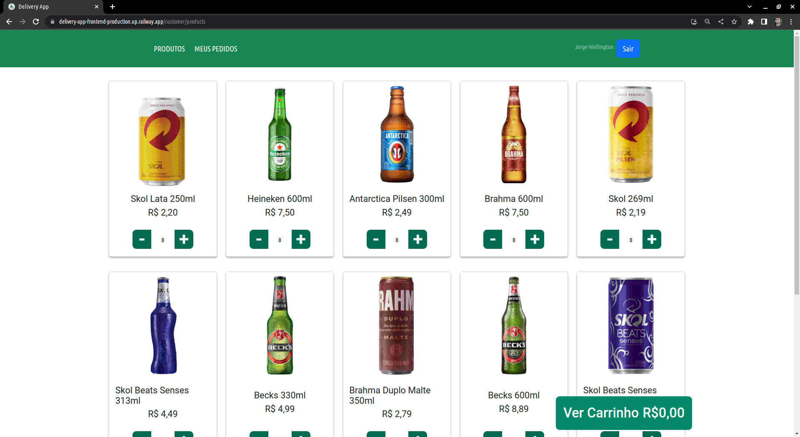

# Seja Bem-Vindo(a) ao repositório do projeto Delivery App

Delivery App é um projeto que simula um aplicativo de delivery para uma distribuidora de bebidas. Ele permite que os usuários façam login, cadastrem-se, realizem pedidos e acompanhem o status dos pedidos. Além disso, a pessoa administradora tem a capacidade de adicionar novos membros da empresa.

  

## Funcionalidades Principais
- Autenticação de usuários: Os usuários podem fazer login para acessar o aplicativo.
- Cadastro de usuário: Os usuários podem se cadastrar fornecendo informações básicas.
- Realização de pedidos: Os usuários podem adicionar bebidas ao carrinho e fazer pedidos.
- Acompanhamento do status do pedido: Os usuários podem verificar se o pedido está em andamento ou já saiu para entrega.
- Administração de membros: A pessoa administradora pode adicionar novos membros da empresa.

## Tecnologias Utilizadas

- JavaScript
- React
- Context API
- Node.js
- Express
- Sequelize (ORM para banco de dados)
- MySQL
- JWT (JSON Web Tokens para autenticação)
- Bootstrap (CSS framework)
- Docker

## Configuração do Ambiente de Desenvolvimento

- Clone em seu computador (via SHH).
- Abra um novo terminal em seu VSCode.
- Certifique-se que tem o node e o docker instalados na sua maquina.
- Faça uma copia do arquivo `.env.exemple` e renomeie para `.env`. 
- execute o comando `docker-compose up -d`.
- Navegue ate o diretório `/back-end` pelo terminal e rode o comando `npm run prestart`.

## Contribuição

Contribuições são bem-vindas! Se você deseja contribuir com o projeto, siga as etapas abaixo:

1. Fork este repositório.
2. Crie um branch com sua nova funcionalidade ou correção de bug: `git checkout -b minha-funcionalidade`.
3. Faça commit das suas alterações: `git commit -m 'Adiciona nova funcionalidade'`.
4. Faça push para o branch: `git push origin minha-funcionalidade`.
5. Envie um pull request.

## Licença

## Developers

- <a href = "https://github.com/bmediato">Beatriz Mediato</a>
- <a href = "https://github.com/brunosbrito">Bruno Brito</a>
- <a href = "https://github.com/Cozmu">Jorge Wellington</a>
- <a href = "https://github.com/vicsantus">Victor Santos</a>

